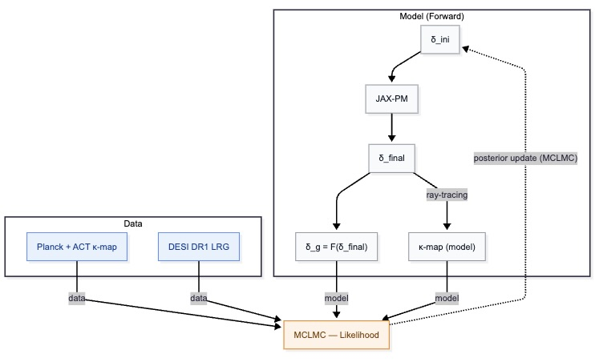

# DESI × CMB Lensing Field-Level Inference
## Pipeline Blueprint & Implementation Roadmap

The scientific objective is to extract cosmological information using field-level inference on DESI galaxy clustering jointly with CMB lensing convergence maps from Planck and ACT.

## Overview



*Figure: Complete field-level inference pipeline. The forward model (top) generates predictions from initial conditions δ_ini through N-body evolution (JAX-PM) to final density δ_final, which produces both galaxy overdensity δ_g and κ-map through ray-tracing. The MCLMC sampler compares these predictions with observed data (DESI LRG + Planck/ACT κ-map) to update the posterior distribution of cosmological parameters and the initial density field.*

The pipeline proceeds through the following stages:

---

## 1. Initial Conditions ✅ (October 2025)

Generate 3D Gaussian random fields representing primordial density fluctuations in a periodic box. These serve as initial conditions for gravitational evolution.

**Implementation:** Power spectrum computation via `jax_cosmo` (Eisenstein–Hu transfer function); 3D field generation in Fourier space; validation through measured power spectra.
**Tests:** `tests/test_initial_conditions.py`
**Notebook:** `notebooks/01_initial_conditions_demo.ipynb`

**Next step:** Gravitational evolution using `jaxpm` to evolve δ(x, z_init) → δ(x, z_obs)

---

## 2. Gravitational Evolution ✅ (October 2025)

Evolve initial density fields forward in time using Lagrangian Perturbation Theory (LPT) and N-body particle-mesh methods with the BullFrog integrator.

**Implementation:**
- Growth factor computations via `jaxpm` ODE solver
- First and second-order LPT displacements
- Full N-body evolution with BullFrog solver from `diffrax`
- Particle-mesh force calculations

**Tests:** `tests/test_evolution.py`
**Notebook:** `notebooks/02_gravitational_evolution_demo.ipynb`

**Next step:** Galaxy bias modeling and redshift-space distortions

---

## 3. Galaxy Bias Modeling ✅ (October 2025)

Transform evolved matter density fields into galaxy density fields using bias models and redshift-space distortions. Add observational noise to create realistic mock data.

**Modules:** `desi_cmb_fli.bricks`, `desi_cmb_fli.nbody`
**Implementation:**
- Kaiser model: Linear bias + RSD in Fourier space
- Lagrangian bias expansion (LBE): Non-linear bias effects following [Modi+2020](http://arxiv.org/abs/1910.07097)
  - Linear bias (b₁)
  - Quadratic bias (b₂)
  - Tidal shear bias (b_s²)
  - Non-local bias (b_∇²)
- Redshift-space distortions from peculiar velocities
- Observational noise (shot noise) modeling
- Posterior sampling with Kaiser approximation

**Tests:** `tests/test_model.py`
**Notebook:** `notebooks/03_galaxy_bias_demo.ipynb`

**Next step:** Field-level inference pipeline

---

## 4. Field-Level Inference ✅ (October 2025)

Full Bayesian inference pipeline for parameter estimation from synthetic and real data.

**Module:** `desi_cmb_fli.model` (FieldLevelModel)
**Implementation:**
- Probabilistic model:
  - Prior distributions for cosmology (Ωm, σ8) based on Planck18
  - Prior distributions for bias parameters (b₁, b₂, b_s², b_∇²)
  - Prior on initial conditions (Gaussian random field)
- Forward model pipeline: IC → evolution (LPT/Kaiser) → bias → observable
- Data conditioning and model blocking
- Kaiser posterior initialization for efficient MCMC warmup
- NUTS or MCLMC sampler for parameter inference

**Supporting modules:**
- `desi_cmb_fli.metrics` - Analysis metrics and power spectra
- `desi_cmb_fli.chains` - Chain utilities and diagnostics
- `desi_cmb_fli.plot` - Visualization tools
- `desi_cmb_fli.samplers` - MCMC samplers (NUTS, MCLMC)

**Tests:** `tests/test_model.py` (11 tests covering model creation, prediction, conditioning, initialization)
**Notebook:** `notebooks/04_field_level_inference.ipynb` - Complete demonstration with synthetic data

---

## 5. CMB Lensing Modeling ✅ (November 2025)

Computation of convergence κ from matter fields using Born approximation.

**Module:** `desi_cmb_fli.cmb_lensing`
**Implementation:**
- Born approximation integration through lightcone
- Lensing kernel integration
- Projection of density fields to convergence maps

---

> [!IMPORTANT]
> **Original Contribution:** All subsequent sections (Step 6 onwards) represent original developments and contributions implemented specifically for this thesis project.

## 6. Joint Field-Level Inference 🚧 (ongoing)

Joint inference on synthetic galaxy + CMB lensing data to constrain cosmology and initial conditions.

**Script:** `scripts/run_inference.py`
**Implementation:**
- **Joint Likelihood**: Combines the galaxy number density likelihood with the CMB lensing convergence ($\kappa$) likelihood.
- **Planck PR4 Noise**: Incorporates realistic reconstruction noise using the official Planck PR4 $N_\ell$ spectrum.
- **High-z Analytical Marginalization**: Accounts for the unmodeled high-redshift ($z > z_{box}$) lensing contribution by analytically marginalizing over the missing volume.
  - The theoretical convergence power spectrum ($C_\ell^{\kappa_{high-z}}$) is computed via `jax_cosmo` using the **Non-Linear Matter Power Spectrum (Halofit)**.
  - This spectrum is added to the noise variance ($N_\ell + C_\ell^{\kappa_{high-z}}$) in the likelihood, correctly treating the high-z signal as an additional structured Gaussian variance (Cosmic Variance) rather than a fixed estimate.
  - **High-Z Correction Strategy (`high_z_mode`)**: Computing the high-z $C_\ell$ spectrum involves ~200k P(k) evaluations. We support three modes:
    - **`fixed`**: Caches $C_\ell^{high-z}$ at the **fiducial cosmology**. Fast, but mathematically inaccurate when sampled parameters drift far from fiducial.
    - **`taylor`** (Default): Uses a **First-Order Taylor Expansion** (Linear Emulator). The gradients $\partial C_\ell / \partial \Omega_m$ and $\partial C_\ell / \partial \sigma_8$ are precomputed at initialization. The likelihood applies a linear correction $C_\ell(\theta) \approx C_\ell(\theta_{fid}) + \nabla C_\ell \cdot \Delta \theta$.
    - **`exact`**: Fully recomputes the integral at every step. Extremely slow, used only for debugging/validation.
- **Angle Calibration (Gnomonic Projection)**: The angular field of view is calculated using exact trigonometry: $\theta = 2 \arctan(L_{trans} / 2\chi_{back})$.
  - This replaces the linear approximation ($\theta \approx L/\chi$) which introduced an error.
  - The Ray-Tracing module uses a tangent-plane projection ($x = \chi \tan(\theta)$) to accurately map the rectilinear simulation box onto the angular grid.
- **Geometry Enforcement**: The model unconditionaly enforces $z_{min}=0$ (Observer at the box face).
- **Even Mesh Dimensions (MCLMC Requirement)**: The mesh dimensions are automatically adjusted to ensure all axes have an **even number of cells**.

### Diagnostic Tools

#### Theoretical Spectrum Comparison (`quick_cl_spectra.py`)

A diagnostic script to compare **simulated spectra** against **theoretical predictions** computed via Limber integration with `jax_cosmo`:

- **Theoretical Spectra**: Uses `compute_theoretical_cl_kappa`, `compute_theoretical_cl_gg`, and `compute_theoretical_cl_kg` from `cmb_lensing.py` to compute:
  - $C_\ell^{\kappa\kappa}$ – Convergence auto-spectrum (Limber integral with lensing kernel)
  - $C_\ell^{gg}$ – Galaxy auto-spectrum (with linear bias $b_1$)
  - $C_\ell^{\kappa g}$ – Cross-spectrum (galaxy-convergence correlation)
- **Multi-Realization Support**: Averages over multiple realizations to estimate cosmic variance.
- **Noise Overlay**: Plots `Theory + $N_\ell$` curves for direct comparison with observed spectra.

#### Energy Variance Diagnostics

The MCLMC sampler's performance is critically dependent on the **energy variance** parameter (`desired_energy_var` in `config.yaml`). The script `run_inference.py` implements automatic diagnostics after warmup:

1. **Per-Chain Energy Variance**: After the first sampling batch, the script reports `MSE/dim` for each chain individually.
2. **Ratio Check**: Compares the actual energy variance to the desired value. A ratio $< 2\times$ is considered acceptable.
3. **Tuning Guidance**: If the ratio is too high, reduce `desired_energy_var` in `config.yaml`. Values around `5e-8` to `5e-7` have been found to work well for this pipeline (down from initial values of `5e-4`).

> [!TIP]
> If all 4 chains show energy variance close to the desired value after warmup, the sampler is well-tuned. If ratios are consistently $> 2\times$, try reducing `desired_energy_var` by a factor of 10.

---

## CMB Diagnostic Features

### ACT DR6 Noise File

**Location:** `data/N_L_kk_act_dr6_lensing_v1_baseline.txt`

Contains the lensing reconstruction noise power spectrum N_ℓ^κκ for ACT Data Release 6. Format: two columns (ℓ, N_ℓ). Used in the CMB lensing likelihood to account for reconstruction noise.

### Artificial Noise Scaling

**Parameter:** `cmb_noise_scaling` (default: 1.0)

Multiplies the CMB noise N_ell by a factor to test sensitivity to noise level.

**Example:**
```yaml
cmb_lensing:
  cmb_noise_scaling: 0.01  # Reduces noise by 100×
```

### CMB-Only Mode

**Parameter:** `galaxies_enabled` (default: true)

Allows disabling galaxy likelihood to run CMB-only inference.

**Example:**
```yaml
model:
  galaxies_enabled: false  # Disable galaxies
cmb_lensing:
  enabled: true  # Keep CMB
```

---

## Next Steps

1. **Preconditioning for Joint Inference** - Incorporate CMB lensing terms into the MCLMC/MAMS preconditioning matrices for improved sampling efficiency.
2. **Implement Lightcone for Galaxy Field** - Account for structure evolution and geometric projection within the simulation box (moving beyond the current snapshot/effective-redshift approximation).
3. **Field-Level Inference on Real Data** - Application to joint DESI LRG $\times$ Planck/ACT $\kappa$-map datasets.

Implementation details will be documented as development progresses.
