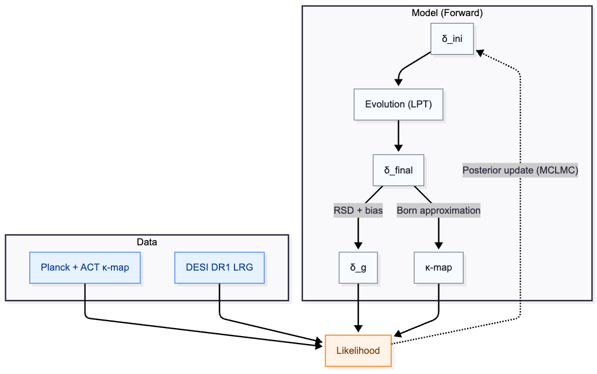

# DESI × CMB Lensing Field-Level Inference
## Pipeline Blueprint & Implementation Roadmap

The scientific objective is to extract cosmological information using field-level inference on DESI galaxy clustering jointly with CMB lensing convergence maps from Planck and ACT.

## Overview



*Figure: Complete field-level inference pipeline. The forward model (top) generates predictions from initial conditions δ_ini through N-body evolution (JAX-PM) to final density δ_final, which produces both galaxy overdensity δ_g and κ-map through ray-tracing. The MCLMC sampler compares these predictions with observed data (DESI LRG + Planck/ACT κ-map) to update the posterior distribution of cosmological parameters and the initial density field.*

The pipeline proceeds through the following stages:

---

## 1. Initial Conditions ✅ (October 2025)

Generate 3D Gaussian random fields representing primordial density fluctuations in a periodic box. These serve as initial conditions for gravitational evolution.

**Implementation:** Power spectrum computation via `jax_cosmo` (Eisenstein–Hu transfer function); 3D field generation in Fourier space; validation through measured power spectra.
**Tests:** `tests/test_initial_conditions.py`
**Notebook:** `notebooks/01_initial_conditions_demo.ipynb`

**Next step:** Gravitational evolution using `jaxpm` to evolve δ(x, z_init) → δ(x, z_obs)

---

## 2. Gravitational Evolution ✅ (October 2025)

Evolve initial density fields forward in time using Lagrangian Perturbation Theory (LPT) and N-body particle-mesh methods with the BullFrog integrator.

**Implementation:**
- Growth factor computations via `jaxpm` ODE solver
- First and second-order LPT displacements
- Full N-body evolution with BullFrog solver from `diffrax`
- Particle-mesh force calculations

**Tests:** `tests/test_evolution.py`
**Notebook:** `notebooks/02_gravitational_evolution_demo.ipynb`

**Next step:** Galaxy bias modeling and redshift-space distortions

---

## 3. Galaxy Bias Modeling ✅ (October 2025)

Transform evolved matter density fields into galaxy density fields using bias models and redshift-space distortions. Add observational noise to create realistic mock data.

**Modules:** `desi_cmb_fli.bricks`, `desi_cmb_fli.nbody`
**Implementation:**
- Kaiser model: Linear bias + RSD in Fourier space
- Lagrangian bias expansion (LBE): Non-linear bias effects following [Modi+2020](http://arxiv.org/abs/1910.07097)
  - Linear bias (b₁)
  - Quadratic bias (b₂)
  - Tidal shear bias (b_s²)
  - Non-local bias (b_∇²)
- Redshift-space distortions from peculiar velocities
- Observational noise (shot noise) modeling
- Posterior sampling with Kaiser approximation

**Tests:** `tests/test_model.py`
**Notebook:** `notebooks/03_galaxy_bias_demo.ipynb`

**Next step:** Field-level inference pipeline

---

## 4. Field-Level Inference ✅ (October 2025)

Full Bayesian inference pipeline for parameter estimation from synthetic and real data.

**Module:** `desi_cmb_fli.model` (FieldLevelModel)
**Implementation:**
- Probabilistic model:
  - Prior distributions for cosmology (Ωm, σ8) based on Planck18
  - Prior distributions for bias parameters (b₁, b₂, b_s², b_∇²)
  - Prior on initial conditions (Gaussian random field)
- Forward model pipeline: IC → evolution (LPT/Kaiser) → bias → observable
- Data conditioning and model blocking
- Kaiser posterior initialization for efficient MCMC warmup
- NUTS or MCLMC sampler for parameter inference

**Supporting modules:**
- `desi_cmb_fli.metrics` - Analysis metrics and power spectra
- `desi_cmb_fli.chains` - Chain utilities and diagnostics
- `desi_cmb_fli.plot` - Visualization tools
- `desi_cmb_fli.samplers` - MCMC samplers (NUTS, MCLMC)

**Tests:** `tests/test_model.py` (11 tests covering model creation, prediction, conditioning, initialization)
**Notebook:** `notebooks/04_field_level_inference.ipynb` - Complete demonstration with synthetic data

---

## 5. CMB Lensing Modeling ✅ (November 2025)

Computation of convergence κ from matter fields using Born approximation.

**Module:** `desi_cmb_fli.cmb_lensing`

### Born Convergence (`convergence_Born_mesh`)

The Born projection converts each z-slice of the 3D matter mesh into an angular contribution to the convergence map κ. Each slice is reprojected from comoving to angular coordinates via a gnomonic (tangent-plane) projection using bilinear interpolation (`map_coordinates(order=1, mode="wrap")`).

**Anti-aliasing**: the accumulation is done in **Fourier space** with two per-shell corrections:

1. **Bilinear deconvolution**: division by $\mathrm{sinc}^2(\ell\,\Delta x / 2\pi\chi)$ corrects the attenuation introduced by the bilinear interpolation kernel.
2. **Per-shell $\ell_{\max}$ filter**: each shell at comoving distance $\chi$ only contributes angular modes $\ell < k_{\rm Nyq} \times \chi$ where $k_{\rm Nyq} = \pi/\Delta x$. This prevents 3D Nyquist-aliased power from the matter mesh from contaminating the angular spectrum.

The input `density_field` is pre-anti-aliased in 3D by `paint_and_deconv` (interlaced CIC + deconvolution + Fourier crop), so the 2D projection inherits the 3D anti-aliasing and adds its own angular-domain corrections.

The lensing kernel per slice is:
$W_\kappa(\chi, a) = \frac{3}{2}\Omega_m\left(\frac{H_0}{c}\right)^2 \frac{\chi}{a} \cdot \frac{\chi_s - \chi}{\chi_s}$

### Flat-Sky Diagnostic Projection (`project_flat_sky`)

A diagnostic-only function used by `validation.py` and `quick_cl_spectra.py` to project a 3D field (e.g. galaxy counts) onto a 2D angular map. Uses the same anti-aliasing scheme as `convergence_Born_mesh` (sinc² deconvolution + per-shell $\ell_{\max}$ filter in Fourier space).

### AbacusSummit Kappa Extraction (`prepare_abacus_kappa`)

Downsamples a full-sky HEALPix κ map to the model's flat-sky grid:
1. `hp.ud_grade` to NSIDE 4096 (memory)
2. Gnomonic projection at $8\times$ oversampling
3. Fourier crop to target resolution (low-pass + downsample)

---

## 6. Joint Field-Level Inference ✅ (closure mode)

Joint inference on synthetic galaxy + CMB lensing data to constrain cosmology and initial conditions.

**Script:** `scripts/run_inference.py`

### Joint Likelihood

The joint likelihood combines the galaxy number density likelihood with the CMB lensing convergence ($\kappa$) likelihood.

**CMB Likelihood with Full Normalization**: The CMB convergence likelihood is implemented as a Fourier-space Gaussian with proper log-determinant term:
$$\frac{1}{T}\ln P(\kappa_{obs}|\kappa_{pred}) = -\frac{1}{2T}\sum_{\ell} \left[\frac{|\Delta\kappa_\ell|^2}{C_\ell} + \ln C_\ell\right]$$
where $C_\ell = N_\ell + C_\ell^{high-z}$ is the total variance (noise + cosmic variance from unmodeled high-z contribution).
- The log-determinant term $\ln C_\ell$ was previously omitted because it is **constant** in galaxy-only mode (where $C_\ell = N_\ell$ fixed).
- However, in **taylor** and **exact** high-z modes, $C_\ell^{high-z}$ depends on cosmological parameters ($\Omega_m, \sigma_8$), making the log-determinant **parameter-dependent** and required for correct posterior normalization.

**Nyquist Frequency Filtering**: Modes beyond **0.5 × Nyquist frequency** are masked out in the CMB likelihood to avoid constraining with poorly-resolved scales. The fraction is set by `NYQUIST_FRACTION = 0.5` in `cmb_lensing.py`. The Nyquist limit is computed as:
$$\ell_{Nyquist} = \frac{180° \times N_{pix}}{\mathrm{field\_size_{deg}}}$$
Only modes with $\ell \leq 0.5 \times \ell_{Nyquist}$ contribute to the likelihood (chi-squared and log-determinant terms).

**Planck PR4 Noise**: Incorporates realistic reconstruction noise using the official Planck PR4 $N_\ell$ spectrum.

### High-z Analytical Marginalization

Accounts for the unmodeled high-redshift ($z > z_{box}$) lensing contribution by analytically marginalizing over the missing volume.
- The theoretical convergence power spectrum ($C_\ell^{\kappa_{high-z}}$) is computed via `jax_cosmo` using the **Non-Linear Matter Power Spectrum (Halofit)**.
- This spectrum is added to the noise variance ($N_\ell + C_\ell^{\kappa_{high-z}}$) in the likelihood, correctly treating the high-z signal as an additional structured Gaussian variance (Cosmic Variance) rather than a fixed estimate.

#### High-Z Correction Strategy (`high_z_mode`)

Computing the high-z $C_\ell$ spectrum involves ~200k P(k) evaluations. We support three modes:
- **`fixed`**: Caches $C_\ell^{high-z}$ at the **fiducial cosmology**. Fast, but mathematically inaccurate when sampled parameters drift far from fiducial.
- **`taylor`** (Default): Uses a **First-Order Taylor Expansion** (Linear Emulator). The gradients $\partial C_\ell / \partial \Omega_m$ and $\partial C_\ell / \partial \sigma_8$ are precomputed at initialization. The likelihood applies a linear correction $C_\ell(\theta) \approx C_\ell(\theta_{fid}) + \nabla C_\ell \cdot \Delta \theta$.
- **`exact`**: Fully recomputes the integral at every step. Extremely slow, used only for debugging/validation.

### Technical Details

- **Angle Calibration (Gnomonic Projection)**: The angular field of view is calculated using exact trigonometry: $\theta = 2 \arctan(L_{trans} / 2\chi_{back})$.
  - This replaces the linear approximation ($\theta \approx L/\chi$) which introduced an error.
  - The Ray-Tracing module uses a tangent-plane projection ($x = \chi \tan(\theta)$) to accurately map the rectilinear simulation box onto the angular grid.
- **Even Mesh Dimensions (MCLMC Requirement)**: The mesh dimensions are automatically adjusted to ensure all axes have an **even number of cells**.
- **CIC Anti-Aliasing** (`model.paint_and_deconv`): When `paint_oversamp > 1.0`, CIC painting uses interlaced order-2, deconvolution in Fourier space at oversampled resolution, then Fourier crop (`chreshape`) to final mesh shape.

### Lightcone Implementation

- **Geometry convention**: observer at $\chi=0$ (box face), simulation center at $\chi=L_z/2$.
- **Lightcone evolution**: each particle/voxel evolves at local scale factor $a(\chi)$.
- **Galaxy model**:
  - LPT uses particle-wise `a`.
  - Lagrangian bias terms are evaluated with local growth.
  - RSD uses local LOS and local `a` per particle.
- **Kaiser model**: supports both snapshot (scalar `a`) and lightcone (`a(\mathbf{x})`), including LOS fields for curved-sky galaxy clustering.
- **CMB lensing**: kernel is evaluated per slice as $W_\kappa(\chi,a)$ with slice-dependent scale factor.
- **Curved-sky scope**: implemented for galaxy clustering only; CMB lensing remains flat-sky Born projection.
- **N-body scope**: lightcone mode is implemented for LPT; N-body remains snapshot-only.

### Observation Mode: Closure

Controlled by `observation_mode` in `config.yaml` (`utils.ObservationMode` enum):

**`closure`**: generates synthetic `kappa_obs` from `truth_params` via `model.predict`. Used for validation.

### CMB-Only Mode

**Parameter:** `galaxies_enabled` (default: true)

Allows disabling galaxy likelihood to run CMB-only inference.

**Example:**
```yaml
model:
  galaxies_enabled: false  # Disable galaxies
cmb_lensing:
  enabled: true  # Keep CMB
```

**Implementation Details:**

- **Initialization**: Unlike joint/galaxy-only modes, CMB-only cannot use "reverse Kaiser" to initialize the density field from galaxy observations. Instead, the initial mesh is drawn from a **random Gaussian** field scaled by the prior power spectrum $P(k)$.

- **Adaptive Preconditioning**: The Kaiser preconditioning automatically adapts to CMB-only mode:
  $$\text{scale} = \sqrt{1 + n_{gal}^{eff} \cdot b_E^2 \cdot P(k)}$$
  where $n_{gal}^{eff} = n_{gal}$ if galaxies are enabled, and $n_{gal}^{eff} = 0$ otherwise.

  In CMB-only mode ($n_{gal}^{eff} = 0$):
  - $\text{scale} = 1$ (no galaxy information)
  - $\text{transfer} = \sqrt{P(k)}$ (standard power spectrum prior)

  This ensures the prior reflects the **absence of direct density field constraints** from galaxy counts, with information coming solely from the projected $\kappa$ map.

- **Optimizations**: In CMB-only mode, the pipeline automatically:
  - Fixes bias parameters (b₁, b₂, b_s², b_∇²) to fiducial values (not sampled)
  - Skips galaxy position and Lagrangian bias expansion calculations for computational efficiency
  - Creates a dummy galaxy mesh for API consistency

> **Note:** The positive Ω_m-σ_8 correlation observed in CMB-only mode is physical, arising from large-scale lensing geometry and working with h fixed (see `figures/positive_correlation_diagnostic/`).

### Configuration

#### ACT DR6 Noise File

**Location:** `data/N_L_kk_act_dr6_lensing_v1_baseline.txt`

Contains the lensing reconstruction noise power spectrum N_ℓ^κκ for ACT Data Release 6. Format: two columns (ℓ, N_ℓ). Used in the CMB lensing likelihood to account for reconstruction noise.

**Script:** `plot_cmb_noise_comparison.py` - Compares ACT DR6 vs Planck PR4 noise spectra to visualize the improvement in reconstruction noise.

#### Artificial Noise Scaling

**Parameter:** `cmb_noise_scaling` (default: 1.0)

Multiplies the CMB noise N_ell by a factor to test sensitivity to noise level.

**Example:**
```yaml
cmb_lensing:
  cmb_noise_scaling: 0.01  # Reduces noise by 100×
```

---

## 7. Joint FLI – Abacus Validation 🚧 (ongoing)

Joint inference using an external AbacusSummit N-body convergence map with a synthetic noise realization drawn from N_ℓ.

**Required optional dependencies:** `pip install desi-cmb-fli[abacus]` (adds `healpy`, `asdf`, `abacusutils`).

Controlled by `observation_mode: abacus` in `config.yaml`.

### Abacus Mode: Kappa Map Selection and High-z Correction

**Map selection.** We use `kappa_00047.asdf` from AbacusSummit base `c000_ph000`, which has `SourceRedshift = 1089.3` (CMB). Per the AbacusSummit lensing paper, each `kappa_NNNNN` file is a **cumulative convergence map**: the lensing kernel $W(\chi)$ uses $\chi_s = \chi(z_s)$ for the stated source redshift, but the **N-body matter shells are only integrated up to the maximum simulation depth**, which for the base-resolution lightcone is $z \approx 2.45$ ($\chi \approx 3990$ Mpc/h). Shells beyond this are not simulated.

**Line-of-sight matching.** When `observation_mode: abacus`, `kappa_obs` integrates matter to $\chi \approx 3990$ Mpc/h, not to $\chi_{\rm CMB}$. The FLI box depth (`box_shape[2]`) can be shallower than 3990 Mpc/h: `kappa_pred` only integrates to `box_shape[2]`, and the `full_los_correction` adds the residual $C_\ell^{\rm high-z}$ in the likelihood variance for the missing line-of-sight depth $\chi_{\rm box} \to \chi_{\rm high-z\_max}$.

**`chi_high_z_max` parameter.** Set in `cmb_lensing` config. If the box is shallower than $\chi_{\rm abacus}$, set `chi_high_z_max: 3990.0` to cap the variance at the Abacus depth rather than extending it to $\chi_{\rm CMB}$.

---

## 8. Diagnostic & Analysis Tools

### Theoretical Spectrum Comparison (`quick_cl_spectra.py`)

A diagnostic script to compare **simulated or observed spectra** against **theoretical predictions** computed via Limber integration with `jax_cosmo`. Supports both observation modes:

- **Closure mode**: generates N independent LPT realizations from `truth_params`, accumulates spectra, plots mean ± std bands.
- **Abacus mode**: loads the AbacusSummit kappa patch once, draws N independent noise realizations; uses a lightweight proxy model (geometry + N_ℓ only, without a full `FieldLevelModel`). Pass `--no-smooth` to disable the HEALPix band-limit, exposing gnomview aliasing (diagnostic only).
- **Spectra computed**: $C_\ell^{\kappa\kappa}$ (obs and pred), $C_\ell^{gg}$, $C_\ell^{\kappa g}$.
- **Log-binned spectra**: raw 2D spectra are log-binned via `metrics.bin_cl_log` (geometric bin centres, configurable bins/decade) and shown as error-bar markers alongside faded unbinned curves.
- **Noise Overlay**: theory curves shown as `Box`, `Box + high-z`, and `Box + high-z + N_ℓ` dashed lines.

#### Resolution-Aware Limber Theory for $C_\ell^{gg}$ and $C_\ell^{\kappa g}$

The Limber integrals for galaxy and cross-spectra must account for the **finite 3D resolution of the simulation mesh**. The `project_flat_sky` function applies a per-shell cut $\ell_\text{max}(\chi) = k_\text{Nyq} \times \chi$ (where $k_\text{Nyq} = \pi/\Delta x$), zeroing modes that cannot be resolved by the 3D grid.

The fix is to integrate only shells satisfying $k_\perp = (\ell + 0.5)/\chi < k_\text{Nyq}$, i.e.\ $\chi > (\ell + 0.5)/k_\text{Nyq}$:

$$C_\ell^{gg} = \int_{\max(\chi_\text{min},\;(\ell+0.5)/k_\text{Nyq})}^{\chi_\text{max}} \frac{w_g^2(\chi)}{\chi^2}\,P\!\left(\frac{\ell+0.5}{\chi}\right)d\chi$$

This is implemented via the `k_nyq` parameter in `compute_theoretical_cl_gg` and `compute_theoretical_cl_kg` (`cmb_lensing.py`). The script `quick_cl_spectra.py` computes `k_nyq_mesh = π/Δx` from the mesh geometry and passes it automatically. The uncorrected (full-resolution) theory is shown as a dotted reference line on the $C_\ell^{gg}$ panel.

#### Poisson Shot Noise in $C_\ell^{gg}$

The measured galaxy auto-spectrum includes a **Poisson white-noise floor** not present in the Limber signal theory or in the cross-spectrum $C_\ell^{\kappa g}$. For $N_\text{gal}$ discrete tracers over a solid angle $\Omega_\text{sky}$ the shot-noise level is constant in $\ell$:

$$N_\ell^{\text{shot}} = \frac{\Omega_\text{sky}}{N_\text{gal}} = \frac{(L_x / \chi_\text{center})^2}{\bar{n} \cdot L_x L_y L_z}$$

where $\bar{n}$ is `model.gxy_density` [(h/Mpc)³] and the denominator is the total number of simulation particles. The script `quick_cl_spectra.py` computes this level analytically, prints it at run time, and overlays three theory curves on the galaxy panel: the resolution-aware Limber signal alone (`--`), the signal plus shot noise (`-.`), and a horizontal flat line marking $N_\ell^{\text{shot}}$ (`:`). The diagnostic table prints both `ratio` (signal only) and `ratio+shot` columns. The cross-spectrum $C_\ell^{\kappa g}$ is unaffected because the kappa and galaxy fields are independent in the noise, so the shot-noise contribution vanishes in the cross-correlation.

### Fisher Information Analysis (`analyze_fisher_scales.py`)

Computes Fisher information matrices to compare the constraining power of galaxies vs CMB lensing separately:

- **Separate Sensitivities**: Evaluates $\partial C_\ell / \partial \theta$ for each observable (galaxy auto-spectrum, CMB lensing spectrum)
- **Implementation Note (2026-02)**: Uses `model.nell_grid` for CMB noise, `model.gxy_density` for $\bar n$, and enables galaxies via `model.galaxies_enabled` in `cfg['model']`.
- **Exact formulas used in the script**:
  - **CMB lensing (2D Fourier pixels, masked):** with
    $$M = \{\ell: 20 < \ell \le 0.5\,\ell_{Nyq},\ \mathrm{finite}(\partial_{\Omega_m}C_\ell, C_\ell, N_\ell)\},$$
    the script computes
    $$F_{\Omega_m\Omega_m}^{\mathrm{CMB}} = \sum_{p\in M} \frac{1}{2}\left(\frac{\partial C_p/\partial\Omega_m}{C_p+N_p}\right)^2,$$
    and
    $$\sigma(\Omega_m)_{\mathrm{CMB}} = \left(F_{\Omega_m\Omega_m}^{\mathrm{CMB}}\right)^{-1/2}.$$
  - **Galaxy clustering (Gaussian + shot noise, FKP weight):** with $P_N=1/\bar n$ and $P_{gg}(k)=b_E^2P_{mm}(k)$, the script uses the **discrete finite-volume FFT sum** on the anisotropic box lattice:
    $$F_{\Omega_m\Omega_m}^{\mathrm{gxy}} = \frac{1}{2}\sum_{\mathbf{k}\in\mathcal{K},\,\mathbf{k}\neq0}\left[\frac{\bar n P_{gg}(k)}{1+\bar n P_{gg}(k)}\right]^2\left[\frac{\partial\ln P_{gg}(k)}{\partial\Omega_m}\right]^2,$$
    where $\mathcal{K}$ is the exact set of discrete FFT modes $k_i=2\pi\,\mathrm{fftfreq}(N_i,d=L_i/N_i)$.
    $$\sigma(\Omega_m)_{\mathrm{gxy}} = \left(F_{\Omega_m\Omega_m}^{\mathrm{gxy}}\right)^{-1/2}.$$
- **Parameter Constraints**: Computes Fisher matrices and marginal uncertainties for $\Omega_m$ and $\sigma_8$
- **Information Comparison**: Quantifies the relative information from each probe at different noise levels

### Run Analysis and Comparison

**`analyze_run.py`** - Analyze a single inference run:
- Merges batch outputs into a single chain file
- Computes convergence diagnostics (R-hat, ESS)
- Generates corner plots and trace plots; in `abacus` mode, uses `abacus_truth_params` as corner-plot markers instead of `truth_params`
- Supports custom burn-in and chain exclusion

**`compare_runs.py`** - Compare multiple runs with GetDist:
- Triangle plots comparing posterior distributions
- Automatic constraint computation (mean ± std)
- Per-run burn-in and chain filtering
- Customizable labels and output paths

**Usage examples:**
```bash
# Analyze single run with 20% burn-in, excluding chains 0 and 2
python scripts/analyze_run.py --run_dir outputs/run_001 --burn_in 0.2 --exclude_chains 0 2

# Compare three runs
python scripts/compare_runs.py outputs/run_001 outputs/run_002 outputs/run_003 \
    --labels "Galaxies Only" "CMB Only" "Joint" --burn_ins 0.2 0.2 0.2
```

### Kappa Map Visualization (`plot_kappa_maps.py`)

Runs a single forward-model realization and displays the κ maps:
- **Closure mode**: shows κ observed (= pred + noise), κ predicted (noiseless), and galaxy density projected (if `galaxies_enabled`).
- **Abacus mode**: shows Abacus κ + noise and Abacus κ (noiseless).

Uses the same config as `run_inference.py`.

### Benchmarking and Validation

**`benchmark_highz_cl_modes.py`** - Benchmark precision and performance of high-z correction modes (fixed/taylor/exact) across different grid resolutions.

**`test_omega_m_effect.py`** - Validates the positive $\Omega_m$-$\sigma_8$ correlation in CMB-only mode by testing the effect of $\Omega_m$ on lensing power spectrum.

**`plot_lensing_fraction.py`** - Computes the fraction of total CMB lensing signal captured by the simulation box as a function of redshift depth.

### Energy Variance Diagnostics

The MCLMC sampler's performance is critically dependent on the **energy variance** parameter (`desired_energy_var` in `config.yaml`). The script `run_inference.py` implements automatic diagnostics after warmup:

1. **Per-Chain Energy Variance**: After the first sampling batch, the script reports `MSE/dim` for each chain individually.
2. **Ratio Check**: Compares the actual energy variance to the desired value. A ratio $< 2\times$ is considered acceptable.
3. **Tuning Guidance**: If the ratio is too high, reduce `desired_energy_var` in `config.yaml`. Values around `5e-8` to `5e-7` work well for runs with realistic noise levels; for reduced-noise runs (`cmb_noise_scaling: 0.01`) use `5e-9` or lower.

---

## Next Steps

1. **Implement joint analysis of the abacus galaxy + CMB lensing dataset** (currently just implemented for cmb lensing).
2. **Implement survey selection function and masking** to enable realistic analysis of real data with non-uniform coverage and complex geometry.
3. **Implement proper Fisher forecast comparison** between galaxies and CMB lensing to quantify the relative information content of each probe (talk to Arnaud De Mattia).
4. **Compare the analysis to a standard power spectrum analysis** to validate the field-level inference results (talk to Arnaud De Mattia).
5. **Implement curved-sky for CMB lensing** to enable accurate modeling of large angular scales (talk to Wassim Kabalan) and directly take an HEALPix κ-map as input.
6. **Infer $b_1 \times σ_8$** instead of $b_1$ to break degeneracies and improve constraints (talk to Hugo Simon).
7. **Measure the runtime of a single model evaluation** to assess the additional computational cost of the CMB lensing modeling and likelihood compared to the galaxy-only pipeline.
8. **Implement the taylor expansion for the high-z correction at the order two (quadratic)** to improve accuracy when sampling far from the fiducial cosmology.
9. **Preconditioning for Joint Inference** - Incorporate CMB lensing terms into the MCLMC/MAMS preconditioning matrices for improved sampling efficiency.
10. **Field-Level Inference on Real Data** - Application to joint DESI LRG $\times$ Planck/ACT $\kappa$-map datasets.

Implementation details will be documented as development progresses.
